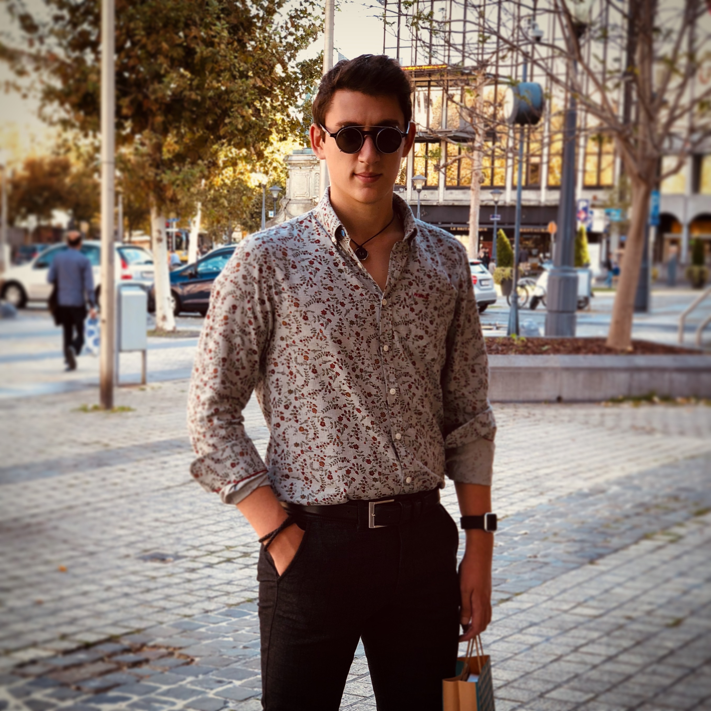

# Laurent Brajkovic

*If it's stupid but work, then it ain't stupid*

## Me in one sentence :
Jack of all trades, master of none: At your service.

Things  	| Answer
--------- | ---------
Birthday 	| 17/12
Favorite color  | Bleen
Pinneapple on pizza | <ul><li> &#9744; Yes, i lack tastebuds </li><li> &#9745; No, i have respect for food </li></ul>

## Hobbies

Upon my now numerous revolutions around our celestial burning ball of helium. I have gathered the following non-work related interests :

* Diving
* Swimming
* Electronis
* Sailling
* Harpoon fishing
* Gaming
* Plastic art
* Algorithmic 3D modelling
* Laser Cutting
* Mechanics
* Hallucinating while staring at ink character on paper
* Flying unmanned aerial vehicles
* Racing unmanned aerial vehicles
* Crashing unmanned aerial vehicles
* Fixing unmanned aerial vehicles
* Presenting in an entertaining manner why unmanned aerial vehicles are an expensive hobby (or anything else really)

## You can always count on me when...

There is a need to find a janky yet functionnal solution 5 minutes before the deadline...  
Or avoiding reaching that point alltogether should you have considered my options when the assignement started :)  
Also i usually bring food...

## One day in my native Croatian village
I saw my grandfather sitting still on a bench, staring into the vast distance of the motherland.  
Being bored and carving social interaction i sat on his left.   He broke the silence by claiming.      "**Never** compliment a woman on her moustache".   Flabbergasted i looked at him in awe, about to utter some words when he turned back to me dramatically and insisted with a right black eye.   "**No matter** how gorgeous it is".

### TLDR
Never compliment a woman on her moustache  
... 
No matter how gorgeous it is...

[<< Julien Daenen](https://github.com/JulienDaenen/markdown-challenge) | Laurent Brajkovic | [Lisa van Hooydonk >>](https://github.com/SporoZoite/markdown-challenge)